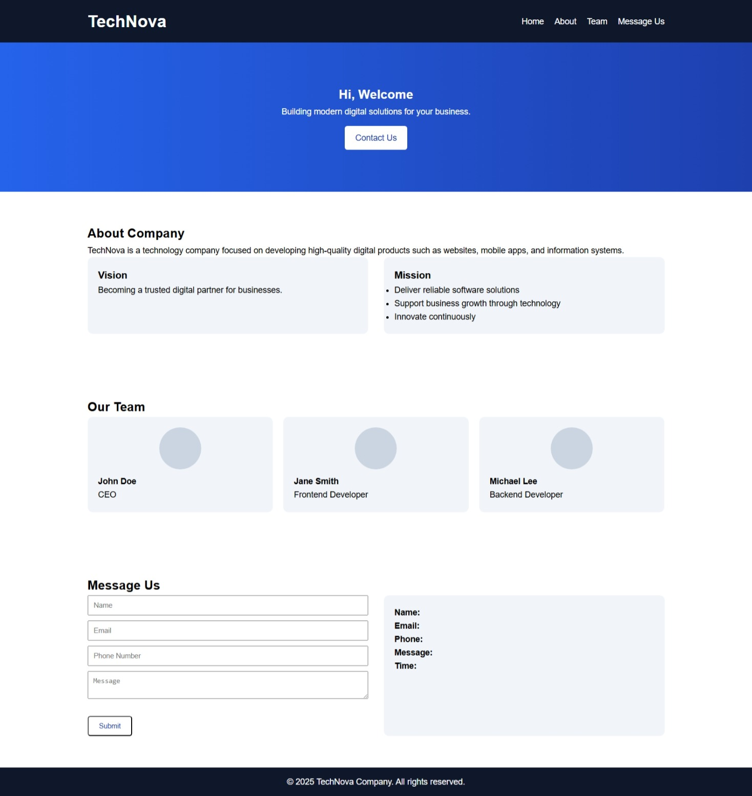

  <h1 align="center">🌐 Company Profile Website</h1>
  

    <b>Coding Camp Project</b> • Responsive • Professional • Clean UI
  

---

## 📖 About The Project
Website **Company Profile** ini dibuat sebagai bagian dari **tugas Coding Camp / RevoU**.  
Project ini menampilkan profil perusahaan dengan desain **modern, aesthetic, dan responsif**, serta menerapkan dasar **front-end development** menggunakan teknologi web standar.

Website ini dirancang agar:
- Mudah dipahami
- Nyaman dilihat
- Siap ditampilkan di GitHub sebagai portofolio awal

---

## 📸 Preview
Tampilan website dapat dilihat pada file berikut:

---

## ✨ Key Features
- 🌟 Responsive layout (Desktop & Mobile)
- 🍔 Navbar dengan hamburger menu di tampilan mobile
- 🏠 Home section dengan welcome message
- 🏢 About Company (Vision & Mission)
- 👥 Team section
- 📝 Message Us form
- ⚡ Menampilkan hasil input form secara langsung
- 🎨 Clean, aesthetic, dan professional UI

---

## 🛠️ Built With
Project ini dibangun menggunakan:
- **HTML5**
- **CSS3**
- **Vanilla JavaScript**

(Tanpa framework atau library tambahan)
